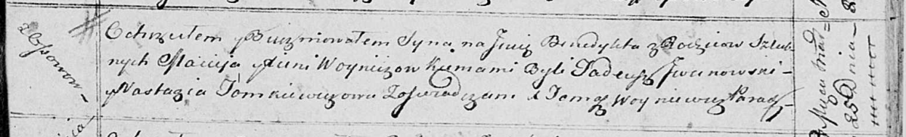

**Войнич Бенедыкт Мацеев (Woynicz Benedykt)**

25 марта 1814 г -- крещение (НИАБ 136-13-894, лист 89, №17/1814-р
(ориг)).

**НИАБ 136-13-894:** Лист 89. **Метрическая запись №17/1814-р (ориг).**

Осовская Покровская церковь. 25 марта 1814 года. Метрическая запись о
крещении.

Woynicz Benedykt -- сын родителей с деревни Осовo.

Woynicz Maciey -- отец.

Woyniczowa Xienia -- мать.

Jwanowski Tadeusz -- кум.

Tomkiewiczowa Nastazija -- кума.

Woyniewicz Tomasz -- ксёндз.
