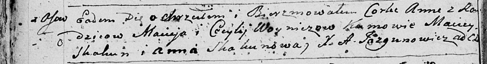

**Войнич Анна Мацеева (Woyniczowna Anna)**

9 марта 1796 г -- крещение (НИАБ 136-13-894, лист 28об, №29/1796-р
(ориг)).

**НИАБ 136-13-894:** Лист 28-об. **Метрическая запись №29/1796-р
(ориг).**

Дедиловичская Покровская церковь. 9 марта 1796 года. Метрическая запись
о крещении.

Woyniczowna Anna -- дочь родителей с деревни Осовo.

Woynicz Maciey -- отец.

Woyniczowa Cecylija -- мать.

Skakun Maciey - кум.

Skakunowa Anna - кума.

Jazgunowicz Antoni -- ксёндз.
