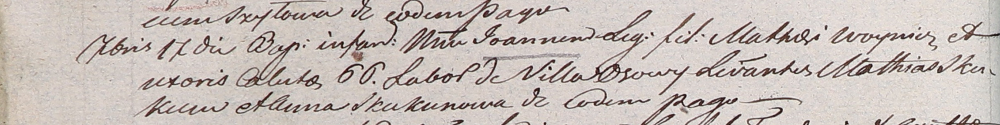

**Войнич Иоанн Мацеев (Woynicz Joann)**

17 сентября 1804 г -- крещение (НИАБ 937-4-32, лист 10об, №21/1804-р).

**НИАБ 937-4-32:** Лист 10об. **Метрическая запись №21/1804-р.**

Дедиловичский костел Наисвятейшего Сердца Иисуса. 17 сентября 1804 года.
Метрическая запись о крещении.

Woynicz Joann -- сын крестьян с деревни Осово.

Woynicz Mathei -- отец.

Woyniczowa Caluto \[Cecilia\] -- мать.

Skakun Mathei -- крестный отец.

Skakunowa Anna -- крестная мать, с деревни Осово.

Galinowski Joann -- ксёндз, комендант Дедиловичского костела.
