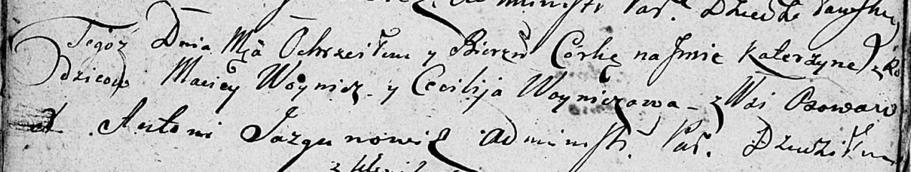

**Войнич Катерына Мацеева (Woyniczowna Katerzyna)**

16 августа 1808 г -- крещение (НИАБ 136-13-894, лист 56об, №26/1808-р
(ориг)).

**НИАБ 136-13-894:** Лист 65об. **Метрическая запись №26/1808-р
(ориг).**

Дедиловичская Покровская церковь. 16 августа 1808 года. Метрическая
запись о крещении.

Woyniczowna Katerzyna -- дочь родителей с деревни Осовo.

Woynicz Maciey -- отец.

Woyniczowa Cecylija -- мать.

Jazgunowicz Antoni -- ксёндз.
