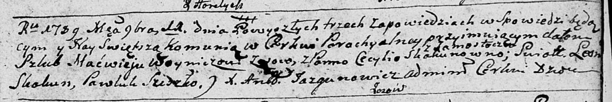
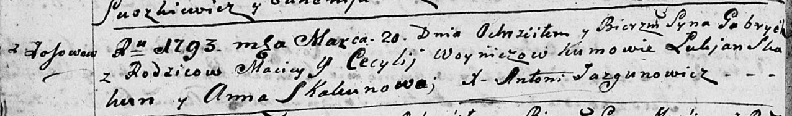
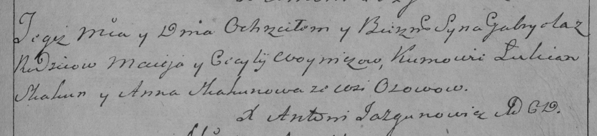
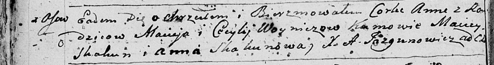
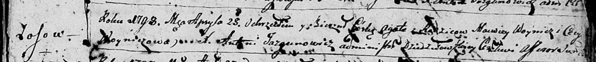
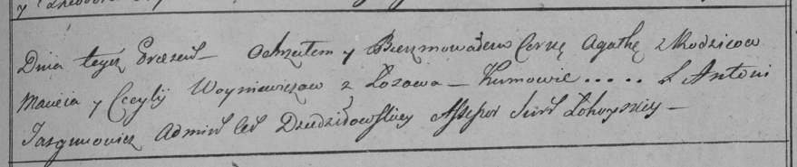
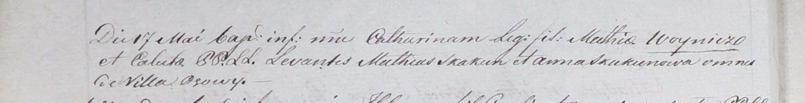
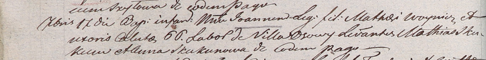
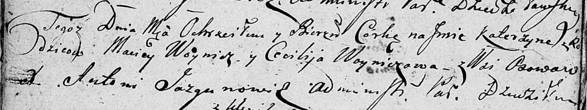

**Войнич Мацей (Woynicz Maciey, Macwiey)**

11 ноября 1789 г -- венчание с Цецылией Скакун с деревни Замосточье
(НИАБ 136-13-894, лист 68, №11/1789-б (ориг)).

20 марта 1793 г -- крещение сына Габриэля (НИАБ 136-13-894, лист 19об,
№33/1793-р (ориг)), (РГИА 823-2-18, лист 247, №13/1793-р (коп)).

9 марта 1796 г -- крещение дочери Анны (НИАБ 136-13-894, лист 28об,
№29/1796-р (ориг)).

25 апреля 1798 г -- крещение дочери Агаты (НИАБ 136-13-894, лист 36,
№18/1798-р (ориг)), (РГИА 823-2-18, лист 263, №18/1798-р (коп)).

17 мая 1801 г -- крещение дочери Катарины (НИАБ 937-4-32, лист 4об,
№10/1800-р).

17 сентября 1804 г -- крещение сына Иоанна (НИАБ 937-4-32, лист 10об,
№21/1804-р).

16 августа 1808 г -- крещение дочери Катерыны (НИАБ 136-13-894, лист
56об, №26/1808-р (ориг)).

**НИАБ 136-13-894:** Лист 68. **Метрическая запись №11/1789-б (ориг).**

Дедиловичская Покровская церковь. 11 ноября 1789 года. Метрическая
запись о венчании.

Woynicz Macwiey -- жених, с деревни Осовo.

Skakunowna Cecylija -- невеста, с деревни Замосточье.

Skakun Leon -- свидетель.

Sziszko? Pawluk -- свидетель.

Jazgunowicz Antoni -- ксёндз.

**НИАБ 136-13-894:** Лист 19-об. **Метрическая запись №33/1793-р
(ориг).**

Дедиловичская Покровская церковь. 20 марта 1793 года. Метрическая запись
о крещении.

Woynicz Gabriel -- сын родителей с деревни Осовo.

Woynicz Maciey -- отец.

Woyniczowa Cecylija -- мать.

Skakun Łukjan - кум.

Skakunowa Anna - кума.

Jazgunowicz Antoni -- ксёндз.

**РГИА 823-2-18:** Лист 247. **Метрическая запись №13/1793-р (коп).**

Дедиловичская Покровская церковь. 20 марта 1793 года. Метрическая запись
о крещении.

Woynicz Gabriel -- сын родителей с деревни Осово.

Woynicz Maciey -- отец.

Woyniczowa Cecylija -- мать.

Skakun Łukian -- кум.

Skakunowa Anna -- кума.

Jazgunowicz Antoni -- ксёндз.

**НИАБ 136-13-894:** Лист 28об. **Метрическая запись №29/1796-р
(ориг).**

Дедиловичская Покровская церковь. 9 марта 1796 года. Метрическая запись
о крещении.

Woyniczowna Anna -- дочь родителей с деревни Осовo.

Woynicz Maciey -- отец.

Woyniczowa Cecylija -- мать.

Skakun Maciey - кум.

Skakunowa Anna - кума.

Jazgunowicz Antoni -- ксёндз.

**НИАБ 136-13-894:** Лист 36. **Метрическая запись №18/1798-р (ориг).**

Дедиловичская Покровская церковь. 25 апреля 1798 года. Метрическая
запись о крещении.

Woyniczowna Agata -- дочь родителей с деревни Осовo.

Woynicz Macwiey -- отец.

Woyniczowa Cecylija -- мать.

Jazgunowicz Antoni -- ксёндз.

**РГИА 823-2-18:** Лист 263. **Метрическая запись №18/1798-р (коп).**

Дедиловичская Покровская церковь. 25 апреля 1798 года. Метрическая
запись о крещении.

Woyniewiczowa Agatha -- дочь родителей с деревни Осово.

Woyniewicz Maciey -- отец.

Woyniewiczowa Cecylija -- мать.

Jazgunowicz Antoni -- ксёндз.

**НИАБ 937-4-32:** Лист 4об. **Метрическая запись №10/1801-р.**

Дедиловичский костел Наисвятейшего Сердца Иисуса. 17 мая 1801 года.
Метрическая запись о крещении.

Woyniczowna Catharina -- дочь крестьян с деревни Осово.

Woynicz Mathias -- отец.

Woyniczowa Caluha \[Cecylia\] -- мать.

Skakun Mathias -- крестный отец, с деревни Осово.

Skakunowa Anna -- крестная мать, с деревни Осово.

Linhart Hyacinthus -- ксёндз.

**НИАБ 937-4-32:** Лист 10об. **Метрическая запись №21/1804-р.**

Дедиловичский костел Наисвятейшего Сердца Иисуса. 17 сентября 1804 года.
Метрическая запись о крещении.

Woynicz Joann -- сын крестьян с деревни Осово.

Woynicz Mathei -- отец.

Woyniczowa Caluto \[Cecilia\] -- мать.

Skakun Mathei -- крестный отец.

Skakunowa Anna -- крестная мать, с деревни Осово.

Galinowski Joann -- ксёндз, комендант Дедиловичского костела.

**НИАБ 136-13-894:** Лист 65об. **Метрическая запись №26/1808-р
(ориг).**

Дедиловичская Покровская церковь. 16 августа 1808 года. Метрическая
запись о крещении.

Woyniczowna Katerzyna -- дочь родителей с деревни Осовo.

Woynicz Maciey -- отец.

Woyniczowa Cecylija -- мать.

Jazgunowicz Antoni -- ксёндз.
