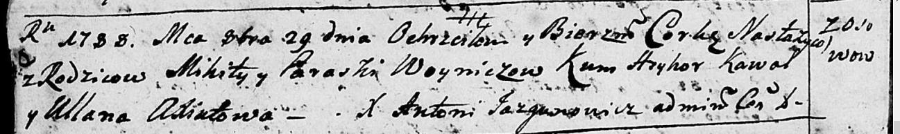

**Войнич Параска (Woyniczowa Paraska)**

29 октября 1788 г -- крещение дочери Настасьи (НИАБ 136-13-894, лист
5об, №57/1788-р (ориг)).

**НИАБ 136-13-894:** Лист 5об. **Метрическая запись №57/1788-р (ориг).**

{width="6.496527777777778in"
height="0.9715627734033245in"}

Дедиловичская Покровская церковь. 29 октября 1788 года. Метрическая
запись о крещении.

Woyniczowna Nastazyja -- дочь родителей с деревни Осово.

Woynicz Mikita-- отец.

Woyniczowa Paraska -- мать.

Kawal Hryhor - кум.

Axiutowa Ullana - кума.

Jazgunowicz Antoni -- ксёндз.
