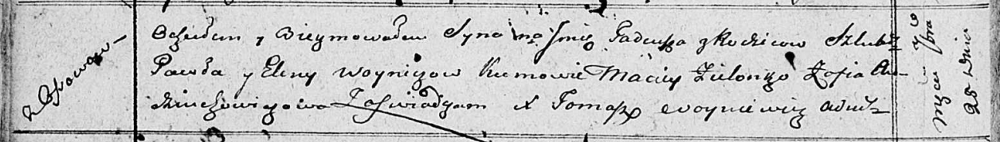

**Войнич Елена (Woyniczowa Elena)**

25 сентября 1810 г -- крещение сына Тадея (НИАБ 136-13-894, лист 78об,
№41/1810-р (ориг)).

**НИАБ 136-13-894:** Лист 78об. **Метрическая запись №41/1810-р
(ориг).**

Осовская Покровская церковь. 25 сентября 1810 года. Метрическая запись о
крещении.

Woynicz Tadeusz -- сын родителей с деревни Осовo.

Woynicz Paweł -- отец.

Woyniczowa Elena -- мать.

Zielonko Maciey -- кум.

Audziuchowiczowa Zofia -- кума.

Woyniewicz Tomasz -- ксёндз.
