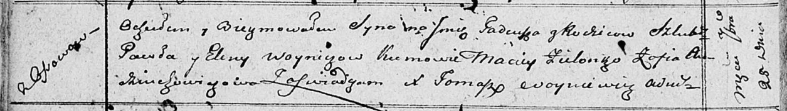

**Войнич Павел (Woynicz Paweł)**

20 января 1796 г -- свидетель венчания Хведора Скакуна с деревни Осово с
девкой Агапой Войнич с деревни Осово (НИАБ 136-13-920, лист 2об,
№1/1796-б (ориг)).

25 сентября 1810 г -- крещение сына Тадея (НИАБ 136-13-894, лист 78об,
№41/1810-р (ориг)).

**НИАБ 136-13-920:** Лист 2об. **Метрическая запись №1/1796-б (ориг).**

{width="6.496527777777778in"
height="1.453655949256343in"}

Дедиловичская Покровская церковь. 20 января 1796 года. Метрическая
запись о венчании.

Skakun Chwiedor -- жених, деревня Осовo.

Woyniczowa Ahapa -- невеста, девка, деревня Осовo.

Skakun Klemiata -- свидетель.

Woynicz Paweł -- свидетель, с деревни Осово.

Jazgunowicz Antoni -- ксёндз.

**НИАБ 136-13-894:** Лист 78об. **Метрическая запись №41/1810-р
(ориг).**

{width="6.496527777777778in"
height="0.9266382327209098in"}

Осовская Покровская церковь. 25 сентября 1810 года. Метрическая запись о
крещении.

Woynicz Tadeusz -- сын родителей с деревни Осовo.

Woynicz Paweł -- отец.

Woyniczowa Elena -- мать.

Zielonko Maciey -- кум.

Audziuchowiczowa Zofia -- кума.

Woyniewicz Tomasz -- ксёндз.
