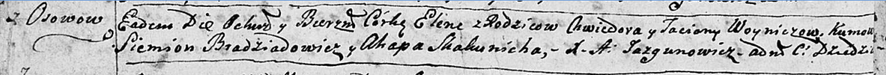

**Войнич Елена Хведорова (Woyniczowna Elena)**

15 мая 1793 г -- крещение дочери Елены (НИАБ 136-13-894, лист 19об,
№42/1793-р (ориг)).

**НИАБ 136-13-894:** Лист 19-об. **Метрическая запись №42/1793-р
(ориг).**

{width="6.496527777777778in"
height="0.5545078740157481in"}

Дедиловичская Покровская церковь. 15 мая 1793 года. Метрическая запись о
крещении.

Woyniczowna Elena -- дочь родителей с деревни Осовo.

Woynicz Chwiedor -- отец.

Woyniczowa Taćiana -- мать.

Bradziadowicz Siemion - кум.

Skakunicha Ahapa - кума.

Jazgunowicz Antoni -- ксёндз.
