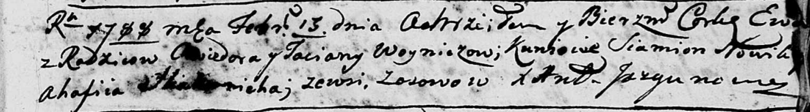
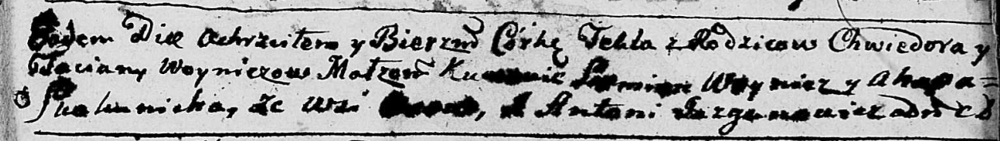
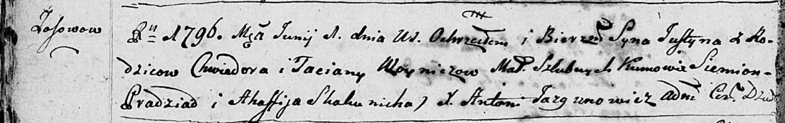
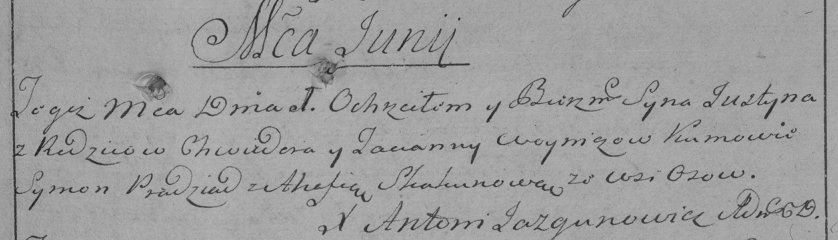
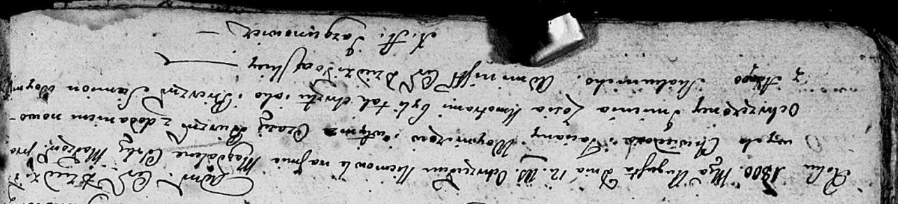
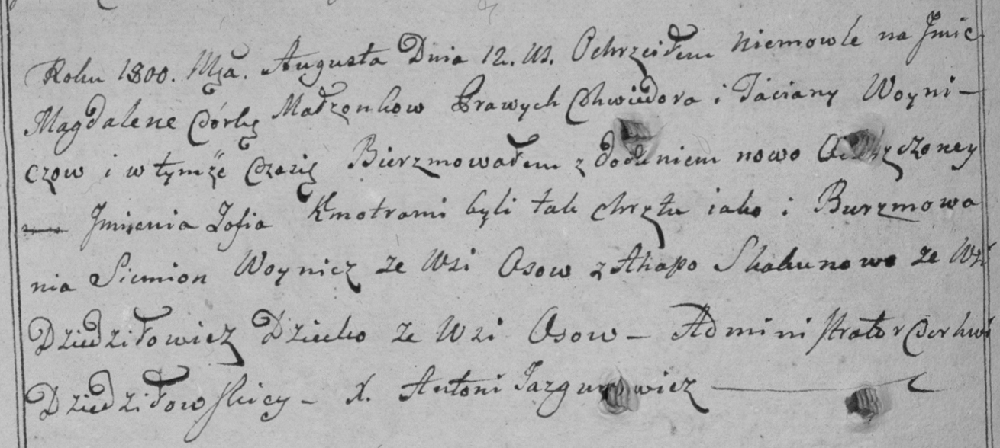
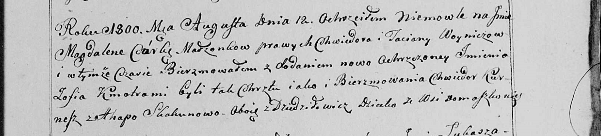

**Войнич Татьяна (Woyniczowa Taciana, Taćiana)**

13 февраля 1788 г -- крещение дочери Евы (НИАБ 136-13-894, лист 4,
№18/1788-р (ориг)).

29 октября 1790 г -- крещение дочери Текли (НИАБ 136-13-894, лист 11,
№67/1790-р (ориг)).

15 мая 1793 г -- крещение дочери Елены (НИАБ 136-13-894, лист 19об,
№42/1793-р (ориг)).

1 июня 1796 г -- крещение сына Юстына (НИАБ 136-13-894, лист 29об,
№58/1796-р (ориг)), (РГИА 823-2-18, лист 256, №30/1796-р (коп)).

12 августа 1800 г -- крещение дочери Магдалены Зоси (НИАБ 136-13-894,
лист 41об, №22/1800-р (ориг), РГИА 823-2-18, лист 276об, №21/1800-р
(коп), НИАБ 136-13-949, лист 103, №24/1800-р (коп)).

**НИАБ 136-13-894:** Лист 4. **Метрическая запись №18/1788-р (ориг).**

Дедиловичская Покровская церковь. 13 февраля 1788 года. Метрическая
запись о крещении.

Woyniczowna Ewa -- дочь родителей с деревни Осово.

Woynicz Chwiedor -- отец.

Woyniczowa Taciana -- мать.

Nowik Siamion - кум.

Skakunicha Ahafiia - кума.

Jazgunowicz Antoniusz -- ксёндз.

**НИАБ 136-13-894:** Лист 11. **Метрическая запись №67/1790-р (ориг).**

Дедиловичская Покровская церковь. 29 октября 1790 года. Метрическая
запись о крещении.

Woyniczowna Tekla -- дочь родителей с деревни Осово.

Woynicz Chwiedor -- отец.

Woyniczowa Taciana -- мать.

Woynicz Siemion - кум.

Skakunicha Ahapa - кума.

Jazgunowicz Antoni -- ксёндз.

**НИАБ 136-13-894:** Лист 19-об. **Метрическая запись №42/1793-р
(ориг).**

Дедиловичская Покровская церковь. 15 мая 1793 года. Метрическая запись о
крещении.

Woyniczowna Elena -- дочь родителей с деревни Осовo.

Woynicz Chwiedor -- отец.

Woyniczowa Taćiana -- мать.

Bradziadowicz Siemion - кум.

Skakunicha Ahapa - кума.

Jazgunowicz Antoni -- ксёндз.

**НИАБ 136-13-894:** Лист 29-об. **Метрическая запись №58/1796-р
(ориг).**

Дедиловичская Покровская церковь. 1 июня 1796 года. Метрическая запись о
крещении.

Woynicz Justyn -- сын родителей с деревни Осовo.

Woynicz Chwiedor -- отец.

Woyniczowa Taciana -- мать.

Pradziad Siemion - кум.

Skakunicha Agafija - кума.

Jazgunowicz Antoni -- ксёндз.

**РГИА 823-2-18:** Лист 256. **Метрическая запись №30/1796-р (коп).**

Дедиловичская Покровская церковь. 1 июня 1796 года. Метрическая запись о
крещении.

Woynicz Justyn -- сын родителей с деревни Осово.

Woynicz Chwiedor -- отец.

Woyniczowa Tacianna -- мать.

Pradziad Symon -- кум.

Skakunowa Ahafia -- кума.

Jazgunowicz Antoni -- ксёндз.

**НИАБ 136-13-894:** Лист 41об. **Метрическая запись №22/1800-р
(ориг).**

Дедиловичская Покровская церковь. 12 августа 1800 года. Метрическая
запись о крещении.

Woyniczowna Magdalena Zosia -- дочь родителей \[с деревни Осово\].

Woynicz Chwiedor -- отец.

Woyniczowa Taciana -- мать.

Woynicz Siemion -- кум.

Skakunicha Ahapa -- кума.

Jazgunowicz Antoni -- ксёндз.

**РГИА 823-2-18:** Лист 276об. **Метрическая запись №21/1800-р (коп).**

Дедиловичская Покровская церковь. 12 августа 1800 года. Метрическая
запись о крещении.

Woyniczowna Magdalena Zofija -- дочь родителей с деревни Осово.

Woynicz Chwiedor -- отец.

Woyniczowa Taciana -- мать.

Woynicz Siemion -- кум, с деревни Дедиловичи.

Skakunowa Ahapa -- кума, с деревни Осово.

Jazgunowicz Antoni -- ксёндз.

**НИАБ 136-13-949:** Лист 103. **Метрическая запись №24/1800-р (коп).**

(См. тж.: РГИА 823-2-18, лист 276об, №21/1800-р (коп), НИАБ 136-13-894,
лист 41об, №22/1800-р (ориг))

Дедиловичская Покровская церковь. 12 августа 1800 года. Метрическая
запись о крещении.

Woyniczowna Magdalena Zofia -- дочь родителей с деревни Домашковичи
\[Осово\].

Woynicz Chwiedor -- отец.

Woyniczowa Taciana -- мать.

Kurnesz Chwiedor \[Woynicz Siemion\] -- кум, с деревни Дедиловичи.

Skakunowa Ahapa - кума, с деревни Дедиловичи.

Jazgunowicz Antoni -- ксёндз.
