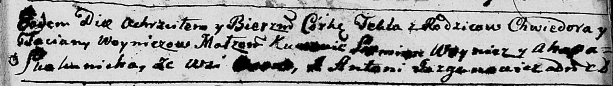

**Войнич Текля Хведорова (Woyniczowna Tekla)**

29 октября 1790 г -- крещение (НИАБ 136-13-894, лист 11, №67/1790-р
(ориг)).

**НИАБ 136-13-894:** Лист 11. **Метрическая запись №67/1790-р (ориг).**

{width="6.496527777777778in"
height="0.9159109798775154in"}

Дедиловичская Покровская церковь. 29 октября 1790 года. Метрическая
запись о крещении.

Woyniczowna Tekla -- дочь родителей с деревни Осово.

Woynicz Chwiedor -- отец.

Woyniczowa Taciana -- мать.

Woynicz Siemion - кум.

Skakunicha Ahapa - кума.

Jazgunowicz Antoni -- ксёндз.
