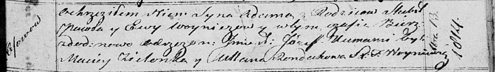

**Войнич Якоб (Woynicz Jakob)**

13 декабря 1814 г -- крещение сына Адама Иосифа (НИАБ 136-13-894, лист
91, №70/1814-р (ориг)).

**НИАБ 136-13-894:** Лист 91. **Метрическая запись №70/1814-р (ориг).**

{width="6.496527777777778in"
height="0.9521183289588802in"}

Осовская Покровская церковь. 13 декабря 1814 года. Метрическая запись о
крещении.

Woynicz Adam Jozef -- сын родителей с деревни Осовo.

Woynicz Jacob -- отец.

Woyniczowa Ewa -- мать.

Zielonka Maciey -- кум.

Randakowa Ullana -- кума.

Woyniewicz Tomasz -- ксёндз.
