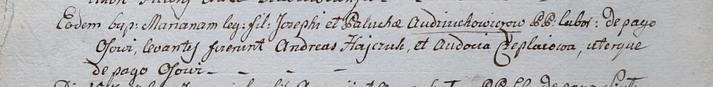

**Гайчук Андрей (Hayczuk Andreas)**

10 июня 1800 г -- крестный отец Марьяны, дочери Иосифа и Палюхи
Авдюховичей с деревни Осово (НИАБ 937-4-32, лист 2, №20/1800-р).

**НИАБ 937-4-32:** Лист 2. **Метрическая запись №20/1800-р.**

{width="6.496527777777778in"
height="0.8041666666666667in"}

Дедиловичский костел Наисвятейшего Сердца Иисуса. 10 июня 1800 года.
Метрическая запись о крещении.

Audziuchowiczowna Mariana -- дочь крестьян с деревни Осово.

Audziuchowicz Joseph -- отец.

Audziuchowiczowa Palucha -- мать.

Hayczuk Andreas -- крестный отец, с деревни Осово.

Czeplaiowa Audocia -- крестная мать, с деревни Осово.

Linhart Hyacinthus -- ксёндз.
