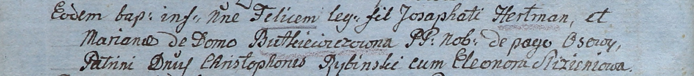

**Гертман (в девичестве Буткевич) Марьяна (Hertmanowa Mariana z
Butkiewiczow)**

28 ноября 1805 г -- крещение сына Феликса (НИАБ 937-4-32, лист 12об,
№43/1805-р).

**НИАБ 937-4-32:** Лист 12об. **Метрическая запись №43/1805-р.**

{width="6.496527777777778in"
height="0.7194444444444444in"}

Дедиловичский костел Наисвятейшего Сердца Иисуса. 28 ноября 1805 года.
Метрическая запись о крещении.

Hertman Felix -- сын шляхтичей с деревни Осово.

Hertman Josaphat -- отец.

Hertmanowa Mariana z Butkiewiczow -- мать.

Rybinski Christophor -- крестный отец, шляхтич.

Slizieniowa Eleonora -- крестная мать, шляхтянка.

Linhart Hiacinthus -- ксёндз.
