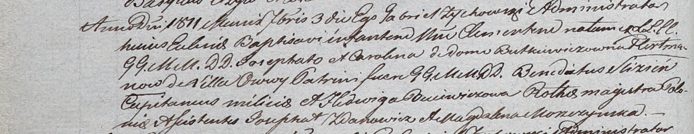

**Гертман Ёзефат, шляхтич (Hertman Jozefat)**

3 сентября 1811 г -- крещение сына Клементия (НИАБ 937-4-32, лист 23об,
№15/1811-р).

23 ноября 1812 г -- крещение сына Геронима Хрызолога (НИАБ 136-13-894,
лист 85об, №54/1812-р (ориг)).

**НИАБ 937-4-32:** Лист 23об. **Метрическая запись №15/1811-р.**

Дедиловичский костел Наисвятейшего Сердца Иисуса. 3 сентября 1811 года.
Метрическая запись о крещении.

Hertman Clementi -- сын шляхтичей с деревни Осово.

Hertman Josephat -- отец.

Hertmanowa Carolina z Butkiewiczow -- мать.

Slizień Benedictus -- крестный отец, шляхтич, капитан.

Buiewiczowa Hedwiga -- крестная мать, шляхтянка, ротмистрша.

Zdanowicz Josephat - ассистент, шляхтич.

Moszczynska Magdalena - ассистентка, шляхтянка.

Zychowski Gabriel -- ксёндз.

**НИАБ 136-13-894:** Лист 85об. **Метрическая запись №54/1812-р
(ориг).**

Осовская Покровская церковь. 23 ноября 1812 года. Метрическая запись о
крещении.

Hertman Heronim Chryzołog, JP -- сын шляхтичей с деревни Осовo.

Hertman Jozefat, JP -- отец, шляхтич.

Hertmanowa z Wilkickich Karolina, JP -- мать, шляхтянка.

Slizień Benedykt, WJP -- кум, шляхтич, поручик бывших войск польских.

Woyniewiczowna Katerzyna, WJP -- кума, шляхтянка.

Kos\...ski Mateusz, JP -- ассистент, шляхтич.

Somorokowa Regina, JP -- ассистентка, шляхтянка.

Woyniewicz Tomasz -- ксёндз.
