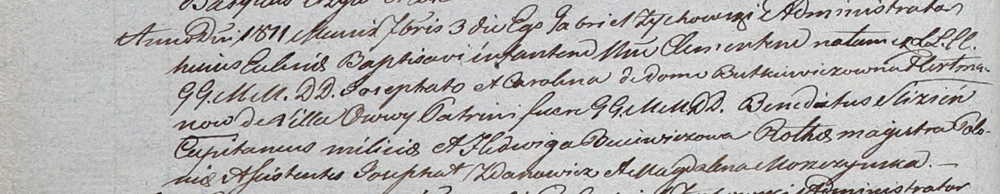

**Гертман Клементий Ёзефатов (Hertman Clementi)**

3 сентября 1811 г -- крещение (НИАБ 937-4-32, лист 23об, №15/1811-р).

**НИАБ 937-4-32:** Лист 23об. **Метрическая запись №15/1811-р.**

Дедиловичский костел Наисвятейшего Сердца Иисуса. 3 сентября 1811 года.
Метрическая запись о крещении.

Hertman Clementi -- сын шляхтичей с деревни Осово.

Hertman Josephat -- отец.

Hertmanowa Carolina z Butkiewiczow -- мать.

Slizień Benedictus -- крестный отец, шляхтич, капитан.

Buiewiczowa Hedwiga -- крестная мать, шляхтянка, ротмистрша.

Zdanowicz Josephat - ассистент, шляхтич.

Moszczynska Magdalena - ассистентка, шляхтянка.

Zychowski Gabriel -- ксёндз.
