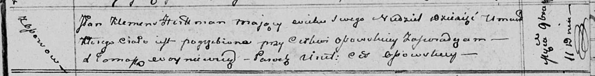

**Гертман Клеменс, шляхтич (Hertman Klemens)**

11 ноября 1811 г -- отпевание, шляхтич, умер в возрасте 1 неделя
(родился 1811) (НИАБ 136-13-919, лист 23, №18/1811-б (ориг)).

**НИАБ 136-13-919:** Лист 23. **Метрическая запись №18/1811-у (ориг).**

Осовская униатская церковь. 11 ноября 1811 года. Метрическая запись об
отпевании.

Hertman Klemens, JP -- умерший, шляхтич, ребенок, неделя, с деревни
Осово, похоронен при церкви деревни Осово.

Woyniewicz Tomasz -- ксёндз.
