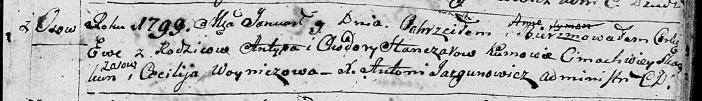
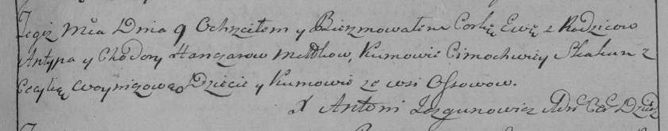

**Гончар Ева Антыпова (Hanczarowna Ewa Anna)**

9 января 1799 г -- крещение (НИАБ 136-13-894, лист 38, №3/1798-р
(ориг)), (РГИА 823-2-18, лист 268, №3/1799-р (коп), НИАБ 136-13-938,
лист 240, №3/1799-р (коп)).

**НИАБ 136-13-894:** Лист 38. **Метрическая запись №3/1799-р (ориг).**

Дедиловичская Покровская церковь. 9 января 1799 года. Метрическая запись
о крещении.

Hanczarowna Ewa Anna -- дочь родителей с деревни Осовo.

Hanczar Antyp -- отец.

Hanczarowa Chadora -- мать.

Skakun Cimachwey -- кум с деревни Осовo.

Woyniczowa Cecylija -- кума.

Jazgunowicz Antoni -- ксёндз.

**РГИА 823-2-18:** Лист 268. **Метрическая запись №3/1799-р (коп).**

Дедиловичская Покровская церковь. 9 января 1799 года. Метрическая запись
о крещении.

Hanczarowna Ewa -- дочь родителей с деревни Осово.

Hanczar Antyp -- отец.

Hanczarowa Chodora -- мать.

Skakun Cimochwiey -- кум, с деревни Осово.

Woyniczowa Cecylia -- кума, с деревни Осово.

Jazgunowicz Antoni -- ксёндз.

Лист 240. **Метрическая запись №3/1799-р (коп).**

(См. тж. НИАБ 136-13-894, лист 38, №3/1799-р (ориг); РГИА 823-2-18, лист
268, №3/1799-р (коп))

Дедиловичская Покровская церковь. 9 января 1799 года. Метрическая запись
о крещении.

Hanczarowa Ewa Katerzyna -- дочь родителей с деревни Осово.

Hanczar Antyp -- отец.

Hanczarowa Chodora -- мать.

Skakun Cimachwiey -- кум, с деревни Осово.

Woyniczowa Cecylia - кума, с деревни Замосточье.

Jazgunowicz Antoni -- ксёндз.
