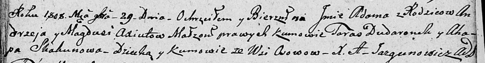

**Дударёнок Тарас (Dudaronek Taras)**

29 ноября 1808 г -- крестный отец Адама, сына Аксют Андрея и Магдуси с
деревни Осово (НИАБ 136-13-894, лист 73, №45/1808-р (ориг)).

**НИАБ 136-13-894: НИАБ 136-13-894:** Лист 73. **Метрическая запись
№45/1808-р (ориг).**

Дедиловичская Покровская церковь. 29 ноября 1808 года. Метрическая
запись о крещении.

Axiuta Adam -- сын родителей с деревни Осово.

Axiuta Andrzey -- отец.

Axiutowa Magdusia -- мать.

Dudaronek Taras -- кум, с деревни Осово.

Skakunowa Ahapa -- кума, с деревни Осово.

Jazgunowicz Antoni -- ксёндз.
