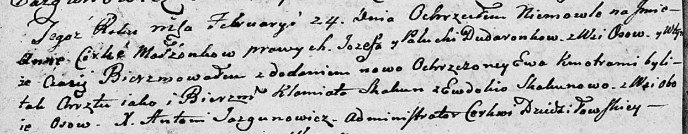

**Дударёнок Палюха (Dudaronkowa Palucha)**

18 июля 1800 г -- крестная мать Михала Павла, сына Скакунов Хведора и
Агапы (НИАБ 136-13-949, лист 102об, №19/1800-р (коп), НИАБ 136-13-949,
лист 103, №21/1800-р (коп)).

24 февраля 1803 г -- крещение дочери Анны Евы (НИАБ 136-13-894, лист
49об, №7/1803-р (ориг)).

**НИАБ 136-13-949:** Лист 102об. **Метрическая запись №19/1800-р
(коп).**

(См. тж.: РГИА 823-2-18, лист 276об, №18/1800-р (коп), НИАБ 136-13-894,
лист 41об, №19/1800-р (ориг))

{width="6.496527777777778in"
height="2.015277777777778in"}

Дедиловичская Покровская церковь. 18 июля 1800 года. Метрическая запись
о крещении.

Skakun Michał Paweł -- сын родителей с деревни Осово.

Skakun Chwiedor -- отец.

Skakunowa Ahapa -- мать.

Kawal Justyn -- кум, с деревни Осово.

Dudaronkowa Pałanieja - кума.

Jazgunowicz Antoni -- ксёндз.

**НИАБ 136-13-949:** Лист 103. **Метрическая запись №21/1800-р (коп).
(**См. тж. Лист 102об. Метрическая запись №19/1800-р (коп))

(См. тж.: РГИА 823-2-18, лист 276об, №18/1800-р (коп), НИАБ 136-13-894,
лист 41об, №19/1800-р (ориг))

{width="6.496527777777778in"
height="2.698611111111111in"}

Дедиловичская Покровская церковь. 18 июля 1800 года. Метрическая запись
о крещении.

Skakun Michał Paweł -- сын родителей с деревни Осово.

Skakun Chwiedor -- отец.

Skakunowa Ahafia -- мать.

Kowal Justyn -- кум, с деревни Осово.

Dudaronkowa Pałanieja - кума, с деревни Осово.

Jazgunowicz Antoni -- ксёндз.

**НИАБ 136-13-894:** Лист 49об. **Метрическая запись №7/1803-р (ориг).**

{width="6.496527777777778in"
height="1.2719488188976378in"}

Дедиловичская Покровская церковь. 24 февраля 1803 года. Метрическая
запись о крещении.

Dudaronkowna Anna Ewa -- дочь родителей с деревни Осово.

Dudaronek Jozef -- отец.

Dudaronkowa Palucha -- мать.

Skakun Klamiato -- кум, с деревни Осово.

Skakunowa Ewdokija -- кума, с деревни Осово.

Jazgunowicz Antoni -- ксёндз.
