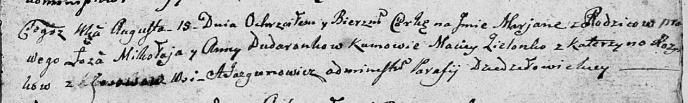

**Дударёнок Миколай (Dudaronek Mikołay)**

15 августа 1809 г -- крещение дочери Марьяны (НИАБ 136-13-894, лист 75,
№41/1809-р (ориг)).

**НИАБ 136-13-894:** Лист 75. **Метрическая запись №41/1809-р (ориг).**

Дедиловичская Покровская церковь. 15 августа 1809 года. Метрическая
запись о крещении .

Dudaronkowna Marjana -- дочь родителей с деревни Осовo.

Dudaronek Mikolay -- отец.

Dudaronkowa Anna -- мать.

Zielonko Maciey -- кум.

Rozynkowa Katerzyna -- кума.

Jazgunowicz Antoni -- ксёндз.
