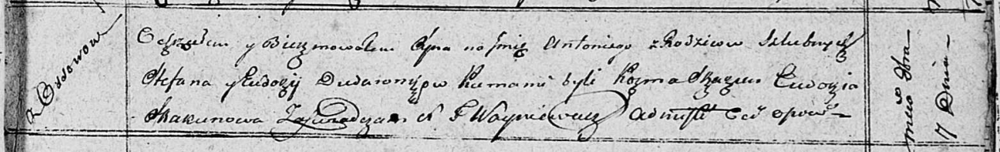

**Дударёнок Степан (Dudaronek Stefan)**

7 октября 1810 г -- крещение сына Антония (НИАБ 136-13-894, лист 79,
№49/1810-р (ориг)).

**НИАБ 136-13-894:** Лист 79. **Метрическая запись №49/1810-р (ориг).**

Осовская Покровская церковь. 7 октября 1810 года. Метрическая запись о
крещении.

Dudaronek Antonij -- сын родителей с деревни Осовo.

Dudaronek Stefan -- отец.

Dudaronkowa Ewdokija -- мать.

Skakun Kozma -- кум.

Skakunowa Eudokia -- кума.

Woyniewicz Tomasz -- ксёндз.
