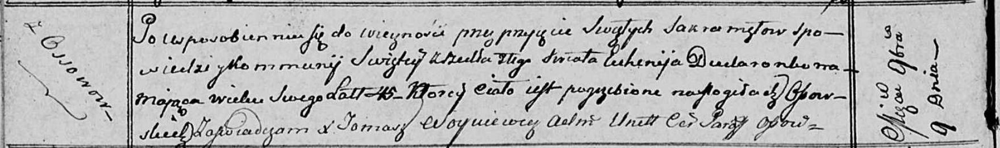

**Дударёнок (в первом браке Сушко) Евгения (Dudaronkowa (Suszkowa)
Euhenija)**

8 февраля 1803 г -- венчание на молодом Стефане Дударёнке с деревни
Осово (НИАБ 136-13-920, лист 9, №3/1803-б (ориг)).

9 мая 1805 г -- крестная мать Елены Юстыны, дочери Синяков Дземьяна и
Парасковии с деревни Клинники (НИАБ 136-13-894, лист 57об, №25/1805-р
(ориг)).

9 ноября 1812 г -- отпевание, умерла в возрасте 45 лет (родилась около
1767 г) (НИАБ 136-13-919, лист 24об, №22/1812-у (ориг)).

**НИАБ 136-13-920:** Лист 9. **Метрическая запись №3/1803-б (ориг).**

{width="6.496527777777778in"
height="1.4355522747156606in"}

Дедиловичская Покровская церковь. 8 февраля 1803 года. Метрическая
запись о венчании.

Dudaronek Stefan -- жених, молодой, с деревни Осовo.

Suszkowa Euhenia -- невеста, вдова, с деревни Клинники.

Woynicz Wasil -- свидетель, с деревни Осовo.

Bartnowski Piotr -- свидетель.

Jazgunowicz Antoni -- ксёндз.

**НИАБ 136-13-894:** Лист 57об. **Метрическая запись №25/1805-р
(ориг).**

{width="6.496527777777778in"
height="1.2525043744531934in"}

Дедиловичская Покровская церковь. 9 мая 1805 года. Метрическая запись о
крещении.

Siniakowna Elena Justyna -- дочь родителей с деревни Клинники.

Siniak Dziemjan -- отец.

Siniakowa Paraskowija -- мать.

Łapać Dawid -- кум.

Dudaronkowa Euhenija -- кума, с деревни Осовo.

Jazgunowicz Antoni -- ксёндз

**НИАБ 136-13-919:** Лист 24об. **Метрическая запись №22/1812-у
(ориг).**

{width="6.496527777777778in"
height="0.9673611111111111in"}

Осовская униатская церковь. 9 ноября 1812 года. Метрическая запись об
отпевании.

Dudaronkowa Euhenija -- умершая, 45 лет, с деревни Осово, похоронена на
кладбище деревни Осово.

Woyniewicz Tomasz -- ксёндз.
