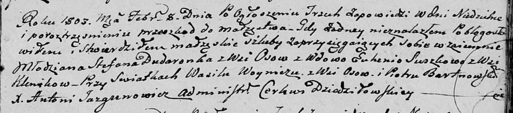

**Дударёнок Стефан (Dudaronek Stefan)**

8 февраля 1803 г -- венчание на вдове Евгении Сушко с деревни Клинники
(НИАБ 136-13-920, лист 9, №3/1803-б (ориг)).

**НИАБ 136-13-920:** Лист 9. **Метрическая запись №3/1803-б (ориг).**

{width="6.496527777777778in"
height="1.4355522747156606in"}

Дедиловичская Покровская церковь. 8 февраля 1803 года. Метрическая
запись о венчании.

Dudaronek Stefan -- жених, молодой, с деревни Осовo.

Suszkowa Euhenia -- невеста, вдова, с деревни Клинники.

Woynicz Wasil -- свидетель, с деревни Осовo.

Bartnowski Piotr -- свидетель.

Jazgunowicz Antoni -- ксёндз.
