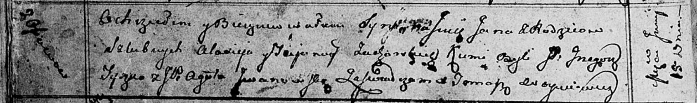

**Жуковская Татьяна (Żukowska Tacjana)**

15 июня 1813 г -- крещение сына Яна (НИАБ 136-13-894, лист 86об,
№15/1813-р (ориг)).

**НИАБ 136-13-894:** Лист 86об. **Метрическая запись №15/1813-р
(ориг).**

{width="6.496527777777778in"
height="0.9702220034995626in"}

Осовская Покровская церковь. 15 июня 1813 года. Метрическая запись о
крещении.

Żukowski Jan -- дочь родителей с деревни Осовo.

Żukowski Alaxiey -- отец.

Żukowska Tacjanna -- мать.

Tyczko Grzegorz, JP -- кум, шляхтич.

Jwanowska Agata -- кума.

Woyniewicz Tomasz -- ксёндз.
