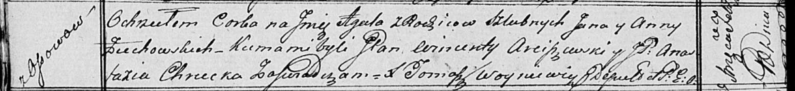

**Жуковская Агата Янова (Zuchowska Agata)**

10 февраля 1817 г -- крещение (НИАБ 136-13-894, лист 95об, №12/1817-р
(ориг)).

**НИАБ 136-13-894:** Лист 95об. **Метрическая запись №12/1817-р
(ориг).**

{width="6.496527777777778in"
height="0.7529779090113736in"}

Осовская Покровская церковь. 10 февраля 1817 года. Метрическая запись о
крещении.

Zuchowska Agata -- дочь родителей с деревни Осовo.

Zuchowski Jan -- отец.

Zuchowska Anna -- мать.

Arciszewski Wincenty, JP -- кум, шляхтич.

Chrucka Anastazia, JP -- кума, шляхтянка.

Woyniewicz Tomasz -- ксёндз.
