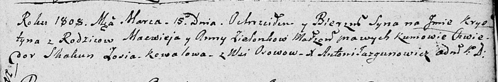

**Зелёнка Крыстын Мацвеев (Zelionka Krystyn)**

15 марта 1808 г -- крещение (НИАБ 136-13-894, лист 65, №15/1808-р
(ориг)).

**НИАБ 136-13-894:** Лист 65. **Метрическая запись №15/1808-р (ориг).**

Дедиловичская Покровская церковь. 15 марта 1808 года. Метрическая запись
о крещении.

Zielonka Krystyn -- сын родителей с деревни Осовo.

Zielonka Macwiey -- отец.

Zielonkowa Anna -- мать.

Skakun Chwiedor -- кум.

Kowalowa Zosia -- кума.

Jazgunowicz Antoni -- ксёндз.
