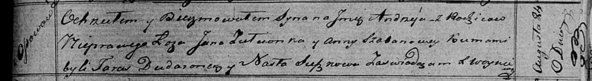

**Зелёнка Ян (Zelionka Jan)**

24 августа 1819 г -- крещение незаконнорожденного сына Андрея (НИАБ
136-13-894, лист 103, №51/1819-р (ориг)).

**НИАБ 136-13-894:** Лист 103. **Метрическая запись №51/1819-р (ориг).**

Осовская Покровская церковь. 24 августа 1819 года. Метрическая запись о
крещении.

Andrzey -- незаконнорожденный сын с деревни Осовo.

Zielonka Jan -- отец.

Szabanowa Anna -- мать.

Dudaronek Taras -- кум.

Suszkowa Nasta -- кума.

Woyniewicz Tomasz -- ксёндз.
