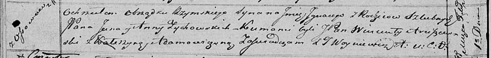

**Зыховский Игнацы Янов, шляхтич (Zychowski Jgnacy)**

1 февраля 1820 г -- крещение (НИАБ 136-13-894, лист 103об, №4/1820-р
(ориг)).

**НИАБ 136-13-894:** Лист 103об. **Метрическая запись №4/1820-р
(ориг).**

{width="6.496527777777778in"
height="0.7670581802274715in"}

Осовская Покровская церковь. 1 февраля 1820 года. Метрическая запись о
крещении.

Zychowski Jgnacy, JP -- сын родителей с деревни Осово, шляхтич.

Zychowski Jan, JP -- отец, шляхтич.

Zychowska Anna, JP -- мать, шляхтянка.

Arciszewski Wincenty, JP -- кум, шляхтич.

Adamowiczowna Katerzyna -- кума.

Woyniewicz Tomasz -- ксёндз.
