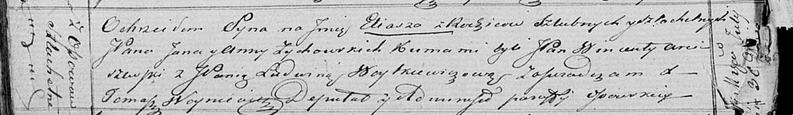

**Зыховский Илья Янов, шляхтич (Zychowski Eliasz)**

30 июля 1821 г -- крещение (НИАБ 136-13-894, лист 106об, №34/1821-р
(ориг)).

**НИАБ 136-13-894:** Лист 106об. **Метрическая запись №34/1821-р
(ориг).**

{width="6.496527777777778in"
height="0.9527887139107611in"}

Осовская Покровская церковь. 30 июля 1821 года. Метрическая запись о
крещении.

Zychowski Eliasz, JP -- сын родителей с деревни Осово, шляхтич.

Zychowski Jan, JP -- отец, шляхтич.

Zychowska Anna, JP -- мать, шляхтянка.

Arciszewski Wincenty, JP -- кум, шляхтич.

Woitkiewiczowa Ludwina, JP -- кума, шляхтянка.

Woyniewicz Tomasz -- ксёндз.
