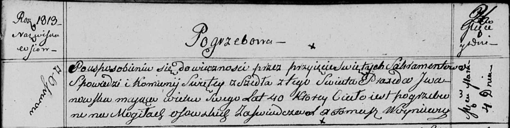

**Ивановская Пракседа (Jwanowska Praxeda)**

4 марта 1813 г -- отпевание, умерла в возрасте 40 лет (родилась около
1810 г) (НИАБ 136-13-919, лист 26, №18/1813-у (ориг)).

**НИАБ 136-13-919:** Лист 26. **Метрическая запись №18/1813-у (ориг).**

Осовская униатская церковь. 4 марта 1813 года. Метрическая запись об
отпевании.

Jwanowska Praxeda -- умершая, 40 лет, с деревни Осово, похоронена на
кладбище деревни Осово.

Woyniewicz Tomasz -- ксёндз.
