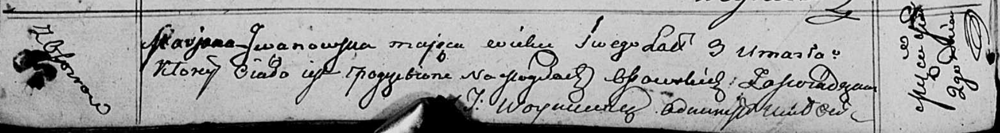

**Ивановская Татьяна (Jwanowska Taciana)**

2 марта 1813 г -- отпевание, умерла в возрасте 3 лет (родилась около
1810 г) (НИАБ 136-13-919, лист 25об, №17/1813-у (ориг)).

**НИАБ 136-13-919:** Лист 25об. **Метрическая запись №17/1813-у
(ориг).**

{width="6.496527777777778in"
height="0.8645833333333334in"}

Осовская униатская церковь. 2 марта 1813 года. Метрическая запись об
отпевании.

Jwanowska Taciana -- умершая, 3 года, с деревни Осово, похоронена на
кладбище деревни Осово.

Woyniewicz Tomasz -- ксёндз.
