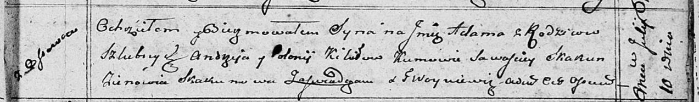

**Кикило Адам Андреев (Kikiło Adam)**

10 июля 1810 г -- крещение (НИАБ 136-13-894, лист 78, №27/1810-р
(ориг)).

**НИАБ 136-13-894:** Лист 78. **Метрическая запись №27/1810-р (ориг).**

Осовская Покровская церковь. 10 июля 1810 года. Метрическая запись о
крещении.

Kikiło Adam -- сын родителей с деревни Осовo.

Kikiło Andrzey -- отец.

Kikiłowa Połonija -- мать.

Skakun Sawasciey -- кум.

Skakunowa Zienowia -- кума.

Woyniewicz Tomasz -- ксёндз.
