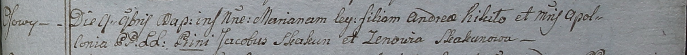
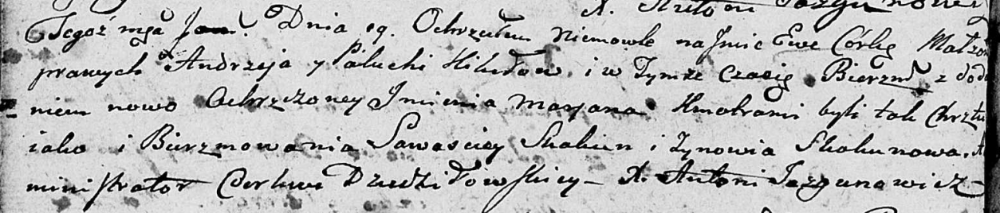
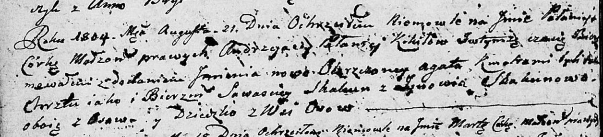
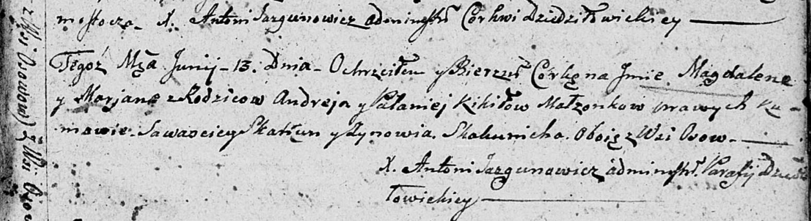
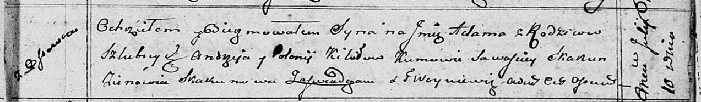

**Кикило Андрей (Kikiło Andrzey, Andrei)**

7 сентября 1796 г -- крещение сына Михала (НИАБ 136-13-894, лист 30об,
№78/1796-р (ориг)).

9 ноября 1798 г -- крещение дочери Марьяны (НИАБ 1781-27-199, лист 123,
№15/1798-р).

19 января 1802 г -- крещение дочери Евы Марьяны (НИАБ 136-13-894, лист
45об, №3/1802-р (ориг)).

21 августа 1804 г -- крещение дочери Паланеи Агаты (НИАБ 136-13-894,
лист 54об, №30/1804-р (ориг)).

13 июня 1807 г -- крещение дочери Магдалены Марьяны (НИАБ 136-13-894,
лист 63, №30/1807-р (ориг)).

10 июля 1810 г -- крещение сына Адама (НИАБ 136-13-894, лист 78,
№27/1810-р (ориг)).

25 февраля 1817 г -- крещение сына Леона (НИАБ 136-13-894, лист 95об,
№14/1817-р (ориг)).

**НИАБ 136-13-894:** Лист 30-об. **Метрическая запись №78/1796-р
(ориг).**

Дедиловичская Покровская церковь. 7 сентября 1796 года. Метрическая
запись о крещении.

Kikiło Michał -- сын родителей с деревни Осовo.

Kikiło Andrzey -- отец.

Kikiłowa Pałaneia -- мать.

Skakun Sawasciey - кум.

Skakunowa Zynowija - кума.

Jazgunowicz Antoni -- ксёндз.

**НИАБ 1781-27-199:** Лист 123. **Метрическая запись №15/1798-р.**

Дедиловичский костел Наисвятейшего Сердца Иисуса. 9 ноября 1798 года.
Метрическая запись о крещении.

Kikiłowna Mariana -- дочь крестьян с деревни Осово.

Kikiło Andrey -- отец.

Kikiłowa Apołłonia -- мать.

Skakun Jakub -- крестный отец.

Skakunowa Zenowia - крестная мать.

Linhart Hyacinthus -- ксёндз.

**НИАБ 136-13-894:** Лист 45об. **Метрическая запись №3/1802-р (ориг).**

Дедиловичская Покровская церковь. 19 января 1802 года. Метрическая
запись о крещении.

Kikiłowna Ewa Marjana -- дочь родителей \[с деревни Осово\].

Kikiło Andrzey -- отец.

Kikiłowa Palucha -- мать.

Skakun Sawasciey -- кум.

Skakunowa Zynowia -- кума.

Jazgunowicz Antoni -- ксёндз.

**НИАБ 136-13-894:** Лист 54об. **Метрическая запись №30/1804-р
(ориг).**

Дедиловичская Покровская церковь. 21 августа 1804 года. Метрическая
запись о крещении.

Kikiłowna Pałanieja Agata -- дочь родителей с деревни Осовo.

Kikiło Andrzey -- отец.

Kikiłowa Pałanieja -- мать.

Skakun Sawasciey -- кум, с деревни Осовo.

Skakunowa Zynowija -- кума, с деревни Осовo.

Jazgunowicz Antoni -- ксёндз.

**НИАБ 136-13-894:** Лист 63. **Метрическая запись №30/1807-р (ориг).**

Дедиловичская Покровская церковь. 13 июня 1807 года. Метрическая запись
о крещении.

Kikiłowna Magdalena Marjana -- дочь родителей с деревни Осовo.

Kikiło Andrey -- отец.

Kikiłowa Pałanieja -- мать.

Skakun Sawasciey -- кум, с деревни Осовo.

Skakunicha Zynowija -- кума, с деревни Осовo.

Jazgunowicz Antoni -- ксёндз.

**НИАБ 136-13-894:** Лист 78. **Метрическая запись №27/1810-р (ориг).**

Осовская Покровская церковь. 10 июля 1810 года. Метрическая запись о
крещении.

Kikiło Adam -- сын родителей с деревни Осовo.

Kikiło Andrzey -- отец.

Kikiłowa Połonija -- мать.

Skakun Sawasciey -- кум.

Skakunowa Zienowia -- кума.

Woyniewicz Tomasz -- ксёндз.

**НИАБ 136-13-894:** Лист 95об. **Метрическая запись №14/1817-р
(ориг).**

Осовская Покровская церковь. 25 февраля 1817 года. Метрическая запись о
крещении.

Kikiło Leon -- сын родителей с деревни Осовo.

Kikiło Andrzey -- отец.

Kikiłowa Polonieja -- мать.

Skakun Sawasciey -- кум.

Hertmanowa Karolina -- кума.

Woyniewicz Tomasz -- ксёндз.
