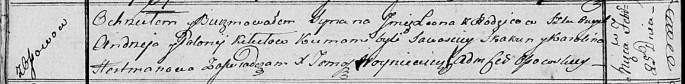

**Кикило Леон Андреев (Kikiło Leon)**

25 февраля 1817 г -- крещение (НИАБ 136-13-894, лист 95об, №14/1817-р
(ориг)).

**НИАБ 136-13-894:** Лист 95об. **Метрическая запись №14/1817-р
(ориг).**

{width="6.496527777777778in"
height="0.8039359142607174in"}

Осовская Покровская церковь. 25 февраля 1817 года. Метрическая запись о
крещении.

Kikiło Leon -- сын родителей с деревни Осовo.

Kikiło Andrzey -- отец.

Kikiłowa Polonieja -- мать.

Skakun Sawasciey -- кум.

Hertmanowa Karolina -- кума.

Woyniewicz Tomasz -- ксёндз.
