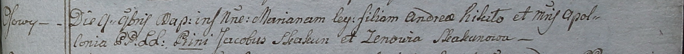

**Кикило Марьяна Андреева (Kikiłowna Mariana)**

9 ноября 1798 г -- крещение (НИАБ 1781-27-199, лист 123, №15/1798-р).

**НИАБ 1781-27-199:** Лист 123. **Метрическая запись №15/1798-р.**

Дедиловичский костел Наисвятейшего Сердца Иисуса. 9 ноября 1798 года.
Метрическая запись о крещении.

Kikiłowna Mariana -- дочь крестьян с деревни Осово.

Kikiło Andrey -- отец.

Kikiłowa Apołłonia -- мать.

Skakun Jakub -- крестный отец.

Skakunowa Zenowia - крестная мать.

Linhart Hyacinthus -- ксёндз.
