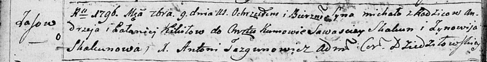

**Кикило Михал Андреев (Kikiło Michał)**

7 сентября 1796 г -- крещение (НИАБ 136-13-894, лист 30об, №78/1796-р
(ориг)).

**НИАБ 136-13-894:** Лист 30-об. **Метрическая запись №78/1796-р
(ориг).**

Дедиловичская Покровская церковь. 7 сентября 1796 года. Метрическая
запись о крещении.

Kikiło Michał -- сын родителей с деревни Осовo.

Kikiło Andrzey -- отец.

Kikiłowa Pałaneia -- мать.

Skakun Sawasciey - кум.

Skakunowa Zynowija - кума.

Jazgunowicz Antoni -- ксёндз.
