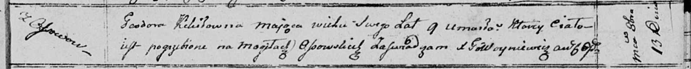

**Кикило Тодора (Kikiłowna Teodora)**

13 октября 1810 г -- отпевание, умерла в возрасте 9 лет (родилась около
1801 г) (НИАБ 136-13-919, лист 22, №9/1810-у (ориг)).

**НИАБ 136-13-919:** Лист 22. **Метрическая запись №9/1810-у (ориг).**

Осовская униатская церковь. 13 октября 1810 года. Метрическая запись об
отпевании.

Kikiłowna Teodora -- умершая, 9 лет, с деревни Осово, похоронена на
кладбище деревни Осово.

Woyniewicz Tomasz -- ксёндз.
