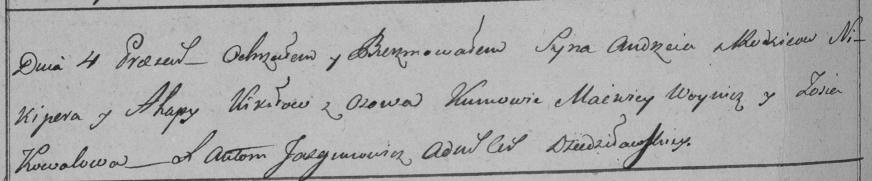

**Кикило Андрей Никиперов (Kikiło Andrzey)**

4 июля 1798 г -- крещение (НИАБ 136-13-894, лист 36, №31/1798-р (ориг)),
(РГИА 823-2-18, лист 264об, №31/1798-р (коп))

**НИАБ 136-13-894:** Лист 36. **Метрическая запись №31/1798-р (ориг).**

{width="6.496527777777778in"
height="0.8555653980752406in"}

Дедиловичская Покровская церковь. 4 июля 1798 года. Метрическая запись о
крещении.

Kikiło Andrzey -- сын \[родителей с деревни Осово\].

Kikiło Nikiper -- отец.

Kikiłowa Ahapa -- мать.

Woynicz Macwiey - кум.

Kowalowa Zosia - кума.

Jazgunowicz Antoni -- ксёндз.

**РГИА 823-2-18:** Лист 264об. **Метрическая запись №31/1798-р (коп).**

{width="6.496527777777778in"
height="1.3486111111111112in"}

Дедиловичская Покровская церковь. 4 июля 1798 года. Метрическая запись о
крещении.

Kikiło Andrzey -- сын родителей с деревни Осово.

Kikiło Nikiper -- отец.

Kikiłowa Ahapa -- мать.

Woynicz Macwiey -- кум.

Kowalowa Zosia -- кума.

Jazgunowicz Antoni -- ксёндз.
