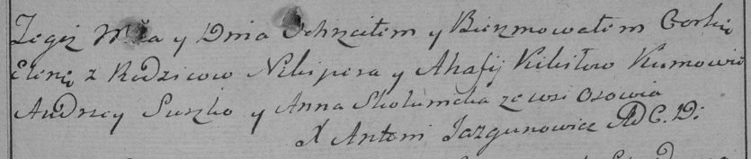

**Кикило Елена Никиперова (Kikiłowna Elena)**

14 февраля 1787 г -- крещение (НИАБ 136-13-894, лист 1, №5/1787-р
(ориг)), (РГИА 823-2-18, лист 233, №6/1787-р (коп))

**НИАБ 136-13-894:** Лист 1. **Метрическая запись №5/1787-р (ориг).**

{width="6.496527777777778in"
height="0.9756944444444444in"}

Дедиловичская Покровская церковь. \[14 февраля\] 1787 года. Метрическая
запись о крещении.

Kikiłowna \[Elena\] -- дочь родителей с деревни Осово.

Kikiło \[Nikiper\] -- отец.

Kikiłowa Ahafia -- мать.

Suszko Andrzej -- кум.

\[Skakunicha Anna\] -- кума.

Jazgunowicz Antoniusz -- ксёндз.

**РГИА 823-2-18:** Лист 233. **Метрическая запись №6/1787-р (коп).**

{width="6.496527777777778in"
height="1.3770833333333334in"}

Дедиловичская Покровская церковь. 14 февраля 1787 года. Метрическая
запись о крещении.

Kikiłowna Elena -- дочь родителей с деревни Осово.

Kikiło Nikiper -- отец.

Kikiłowa Ahafija -- мать.

Suszko Andrzey -- кум.

Skakunicha Anna - кума.

Jazgunowicz Antoni -- ксёндз.
