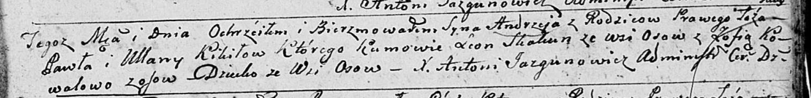

**Кикило Павел (Kikiło Paweł)**

16 февраля 1791 г -- крещение сына Леона (НИАБ 136-13-894, лист 12об,
№5/1791-р (ориг)), (РГИА 823-2-18, лист 241об, №5/1791-р (коп)).

20 ноября 1799 г -- крещение сына Андрея (НИАБ 136-13-894, лист 40,
№49/1799-р (ориг)), (РГИА 823-2-18, лист 273, №48/1799-р (коп)).

20 марта 1804 г -- крестный отец у Татьяны Анны, дочери Буслов Асипа и
Дарыи (НИАБ 136-13-894, лист 53, №8/1804-р (ориг)).

**НИАБ 136-13-894:** Лист 12об. **Метрическая запись №5/1791-р (ориг).**

{width="6.496527777777778in"
height="1.0017355643044619in"}

Дедиловичская Покровская церковь. 16 февраля 1791 года. Метрическая
запись о крещении.

Kikiło Leon -- сын родителей с деревни Осово.

Kikiło Pawel -- отец.

Kikiłowa Ullana -- мать.

Skakun Leon - кум.

Kowalowa Zofija - кума.

Jazgunowicz Antoni -- ксёндз.

**РГИА 823-2-18:** Лист 241об. **Метрическая запись №5/1791-р (коп).**

{width="6.496527777777778in"
height="1.1555555555555554in"}

Дедиловичская Покровская церковь. 16 февраля 1791 года. Метрическая
запись о крещении.

Kikiło Leon -- сын родителей с деревни Осово.

Kikiło Paweł -- отец.

Kikiłowa Ullana -- мать.

Skakun Leon -- кум.

Kowalowa Zofia - кума.

Jazgunowicz Antoni -- ксёндз.

**НИАБ 136-13-894:** Лист 40. **Метрическая запись №49/1799-р (ориг).**

{width="6.496527777777778in"
height="0.7878444881889763in"}

Дедиловичская Покровская церковь. 20 ноября 1799 года. Метрическая
запись о крещении.

Kikiło Andrzey -- сын родителей с деревни Осовo.

Kikiło Paweł -- отец.

Kikiłowa Ullana -- мать.

Skakun Leon -- кум, с деревни Осовo.

Kowalowa Zofia -- кума,с деревни Осовo.

Jazgunowicz Antoni -- ксёндз.

**РГИА 823-2-18:** Лист 273. **Метрическая запись №48/1799-р (коп).**

{width="6.496527777777778in"
height="1.8104166666666666in"}

Дедиловичская Покровская церковь. 20 ноября 1799 года. Метрическая
запись о крещении.

Kikiło Andrzey -- сын родителей с деревни Осово.

Kikiło Paweł -- отец.

Kikiłowa Ullana -- мать.

Skakun Leon -- кум, с деревни Осово.

Kowalowa Zofia -- кума, с деревни Осово.

Jazgunowicz Antoni -- ксёндз.

**НИАБ 136-13-894:** Лист 53. **Метрическая запись №8/1804-р (ориг).**

{width="6.496527777777778in"
height="1.0372725284339457in"}

Дедиловичская Покровская церковь. 20 марта 1804 года. Метрическая запись
о крещении.

Busłowna Taciana Anna -- дочь.

Busła Asip -- отец.

Busłowa Daryia -- мать.

Kikiło Paweł -- кум, с деревни Осовo.

Suszkowa Pałanieja -- кума, с деревни Осовo.

Jazgunowicz Antoni -- ксёндз.
