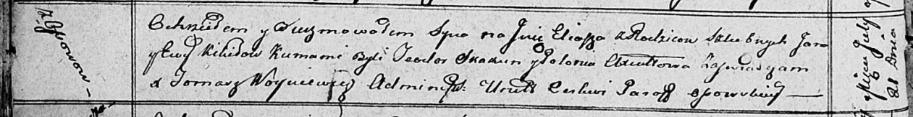

**Кикило Илья Янов (Kikiło Eliasz)**

21 июля 1812 г -- крещение (НИАБ 136-13-894, лист 84об, №34/1812-р
(ориг)).

**НИАБ 136-13-894:** Лист 84об. **Метрическая запись №34/1812-р
(ориг).**

Осовская Покровская церковь. 21 июля 1812 года. Метрическая запись о
крещении.

Kikiło Eliasz -- сын родителей с деревни Осовo.

Kikiło Jan -- отец.

Kikiłowa Ewa -- мать.

Skakun Teodor -- кум.

Axiutowa Połonia -- кума.

Woyniewicz Tomasz -- ксёндз.
