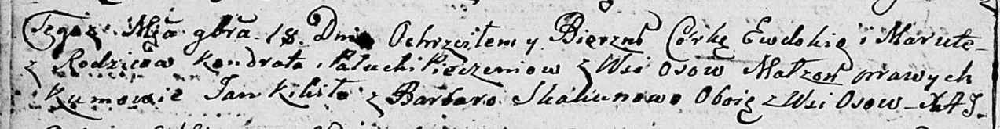
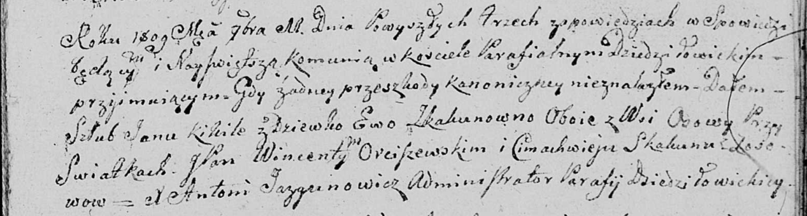
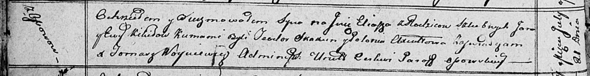
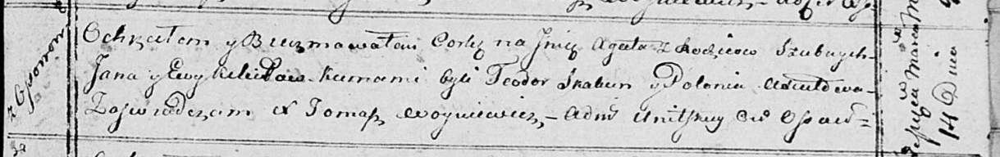
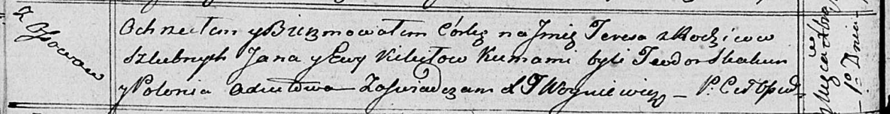
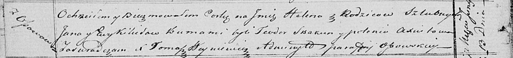

**Кикило Ян (Kikiło Jan)**

18 ноября 1806 г -- крестный отец у Евдокии Маруты, дочери Печенёв
Кондрата и Палюхи с деревни Осово (НИАБ 136-13-894, лист 61об,
№51/1806-р (ориг)).

11 ноября 1809 г -- венчание с девкой Евой Скакун с деревни Осово (НИАБ
136-13-920, лист 16, №21/1809-б (ориг)).

21 июля 1812 г -- крещение сына Ильи (НИАБ 136-13-894, лист 84об,
№34/1812-р (ориг)).

14 марта 1815 г -- крещение дочери Агаты (НИАБ 136-13-894, лист 92,
№13/1815-р (ориг)).

1 декабря 1818 г -- крещение дочери Тересы (НИАБ 136-13-894, лист 99об,
№42/1818-р (ориг)).

13 июня 1821 г -- крещение дочери Елены (НИАБ 136-13-894, лист 106об,
№27/1821-р (ориг)).

**НИАБ 136-13-894:** Лист 61об. **Метрическая запись №51/1806-р
(ориг).**

Дедиловичская Покровская церковь. 18 ноября 1806 года. Метрическая
запись о крещении.

Pieczaniowna Ewdokia Maruta -- дочь родителей с деревни Осовo.

Pieczań Kondrat -- отец.

Pieczaniowa Palucha -- мать.

Kikiło Jan -- кум, с деревни Осовo.

Skakunowa Barbara -- кума, с деревни Осовo.

Jazgunowicz Antoni -- ксёндз.

**НИАБ 136-13-920:** Лист 16. **Метрическая запись №21/1809-б (ориг).**

Дедиловичская Покровская церковь. 11 ноября 1809 года. Метрическая
запись о венчании.

Kikiło Jan -- жених, с деревни Осовo.

Skakunowna Ewa -- невеста, девка с деревни Осовo.

Orciszewski Wincenty, JP -- свидетель, шляхтич.

Skakun Cimachwiey -- свидетель, с деревни Осовo.

Jazgunowicz Antoni -- ксёндз.

**НИАБ 136-13-894:** Лист 84об. **Метрическая запись №34/1812-р
(ориг).**

Осовская Покровская церковь. 21 июля 1812 года. Метрическая запись о
крещении.

Kikiło Eliasz -- сын родителей с деревни Осовo.

Kikiło Jan -- отец.

Kikiłowa Ewa -- мать.

Skakun Teodor -- кум.

Axiutowa Połonia -- кума.

Woyniewicz Tomasz -- ксёндз.

**НИАБ 136-13-894:** Лист 92. **Метрическая запись №13/1815-р (ориг).**

Осовская Покровская церковь. 14 марта 1815 года. Метрическая запись о
крещении.

Kikiłowna Agata -- дочь родителей с деревни Осовo.

Kikiło Jan -- отец.

Kikiłowa Ewa -- мать.

Skakun Teodor -- кум.

Axiutowa Połonija -- кума.

Woyniewicz Tomasz -- ксёндз.

**НИАБ 136-13-894:** Лист 99об. **Метрическая запись №42/1818-р
(ориг).**

Осовская Покровская церковь. 1 декабря 1818 года. Метрическая запись о
крещении.

Kikiłowna Teresa -- дочь родителей с деревни Осовo.

Kikiło Jan -- отец.

Kikiłowa Ewa -- мать.

Skakun Teodor -- кум.

Axiutowa Połonia -- кума.

Woyniewicz Tomasz -- ксёндз.

**НИАБ 136-13-894:** Лист 106об. **Метрическая запись №27/1821-р
(ориг).**

Осовская Покровская церковь. 13 июня 1821 года. Метрическая запись о
крещении.

Kikiłowna Helena -- дочь родителей с деревни Осовo.

Kikiło Jan -- отец.

Kikiłowa Ewa -- мать.

Skakun Teodor -- кум.

Axiutowa Polonia -- кума.

Woyniewicz Tomasz -- ксёндз.
