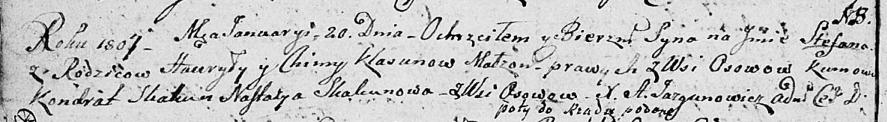

**Клясун Стефан Гаврылов (Klasun Stefan)**

20 января 1807 г -- рождение (НИАБ 136-13-894, лист 61об, №1/1807-р
(коп)).

**НИАБ 136-13-894:** Лист 61об. **Метрическая запись №1/1807-р (ориг).**

{width="6.496527777777778in"
height="0.8984776902887139in"}

Дедиловичская Покровская церковь. 20 января 1807 года. Метрическая
запись о крещении.

Klasun Stefan -- сын родителей с деревни Осовo.

Klasun Hauryła -- отец.

Klasun Chima -- мать.

Skakun Kondrat -- кум, с деревни Осовo.

Skakunowa Nastazya -- кума, с деревни Осовo.

Jazgunowicz Antoni -- ксёндз.
