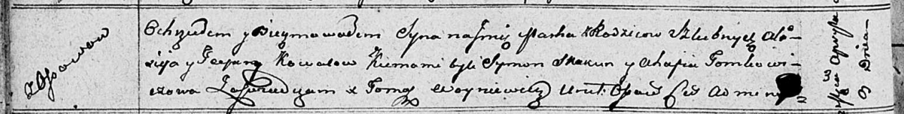

**Коваль Тодора? (Kowalowa Teodora?)**

9 апреля 1811 г -- крещение сына Марка (НИАБ 136-13-894, лист 80об,
№19/1811-р (ориг)).

**НИАБ 136-13-894:** Лист 80об. **Метрическая запись №19/1811-р
(ориг).**

Осовская Покровская церковь. 9 апреля 1811 года. Метрическая запись о
крещении.

Kowal Markо -- сын родителей с деревни Осовo.

Kowal Alisiey -- отец.

Kowalowa Teodora? -- мать.

Skakun Symon -- кум.

Tomkowiczowa Ahafia -- кума.

Woyniewicz Tomasz -- ксёндз.
