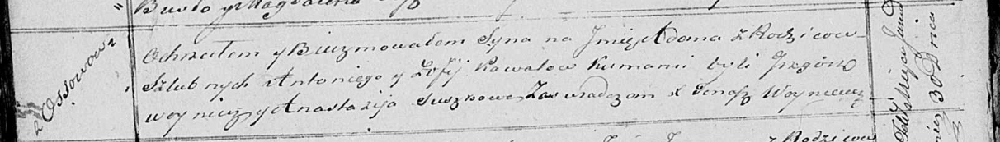

**Коваль Адам Антонов (Kowal Adam)**

30 января 1821 г -- крещение (НИАБ 136-13-894, лист 105об, №3/1821-р
(коп)).

**НИАБ 136-13-894:** Лист 105об. **Метрическая запись №3/1821-р
(ориг).**

Осовская Покровская церковь. 30 января 1821 года. Метрическая запись о
крещении.

Kowal Adam -- сын родителей с деревни Осовo.

Kowal Antoni -- отец.

Kowalowa Zofija -- мать.

Woynicz Grzegorz -- кум.

Suszkowa Anastazyia -- кума.

Woyniewicz Tomasz -- ксёндз.
