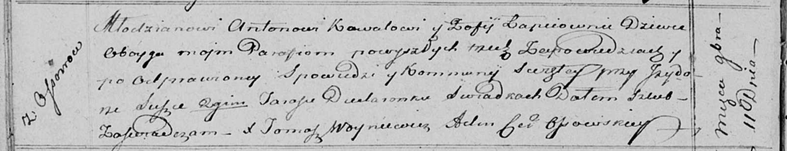

**Коваль Антон (Kowal Anton)**

6 ноября 1807 г -- свидетель венчания молодого Грыгора Сушко с деревни
Осово с девкой Анной Коваль с деревни Осово (НИАБ 136-13-920, лист 13,
№9/1807-б (ориг)).

11 ноября 1815 г -- венчание с девкой Софией Лапец (НИАБ 136-13-920,
лист 22об, №10/1815-б (коп)).

29 марта 1818 г -- крещение дочери Тодоры (НИАБ 136-13-894, лист 98,
№10/1818-р (коп)).

30 января 1821 г -- крещение сына Адама (НИАБ 136-13-894, лист 105об,
№3/1821-р (коп)).

**НИАБ 136-13-920:** Лист 13. **Метрическая запись №9/1807-б (ориг).**

Дедиловичская Покровская церковь. 6 ноября 1807 года. Метрическая запись
о венчании.

Szuszko Hryhor -- жених, молодой, с деревни Осовo.

Kowalowa Anna -- невеста, девка, с деревни Осовo.

Skakun Klamiata -- свидетель, с деревни Осовo.

Kowal Anton -- свидетель, с деревни Осовo.

Jazgunowicz Antoni -- ксёндз.

**НИАБ 136-13-920:** Лист 22об. **Метрическая запись №10/1815-б
(ориг).**

Осовская Покровская церковь. 11 ноября 1815 года. Запись о венчании.

Kowal Antoni -- жених, молодой, парафии Осовской, с деревни Осово.

Łapciowna Zofija -- невеста, девка, парафии Осовской.

Suszko Jzydor -- свидетель.

Dudaronek Taras -- свидетель.

Woyniewicz Tomasz -- ксёндз.

**НИАБ 136-13-894:** Лист 98. **Метрическая запись №10/1818-р (ориг).**

Осовская Покровская церковь. 29 марта 1818 года. Метрическая запись о
крещении.

Kowalowna Teodora -- дочь родителей с деревни Осовo.

Kowal Anton -- отец.

Kowalowa Zofija -- мать.

Woynicz Grzegorz -- кум.

Suszkowa Anastazyja -- кума.

Woyniewicz Tomasz -- ксёндз.

**НИАБ 136-13-894:** Лист 105об. **Метрическая запись №3/1821-р
(ориг).**

Осовская Покровская церковь. 30 января 1821 года. Метрическая запись о
крещении.

Kowal Adam -- сын родителей с деревни Осовo.

Kowal Antoni -- отец.

Kowalowa Zofija -- мать.

Woynicz Grzegorz -- кум.

Suszkowa Anastazyia -- кума.

Woyniewicz Tomasz -- ксёндз.
