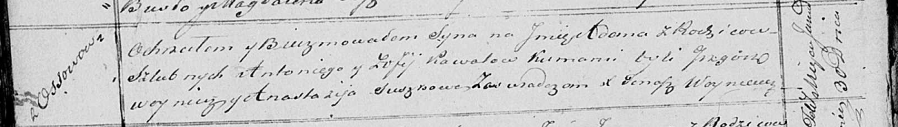

**Коваль (в девичестве Лапец) София (Kowalowa Zofija z Łapciow)**

11 ноября 1815 г -- венчание с молодым Антоном Ковалём с деревни Осово
(НИАБ 136-13-920, лист 22об, №10/1815-б (коп)).

29 марта 1818 г -- крещение дочери Тодоры (НИАБ 136-13-894, лист 98,
№10/1818-р (коп)).

30 января 1821 г -- крещение сына Адама (НИАБ 136-13-894, лист 105об,
№3/1821-р (коп)).

**НИАБ 136-13-920:** Лист 22об. **Метрическая запись №10/1815-б
(ориг).**

{width="6.496527777777778in"
height="1.2598797025371828in"}

Осовская Покровская церковь. 11 ноября 1815 года. Запись о венчании.

Kowal Antoni -- жених, молодой, парафии Осовской, с деревни Осово.

Łapciowna Zofija -- невеста, девка, парафии Осовской.

Suszko Jzydor -- свидетель.

Dudaronek Taras -- свидетель.

Woyniewicz Tomasz -- ксёндз.

**НИАБ 136-13-894:** Лист 98. **Метрическая запись №10/1818-р (ориг).**

{width="6.496527777777778in"
height="0.79790135608049in"}

Осовская Покровская церковь. 29 марта 1818 года. Метрическая запись о
крещении.

Kowalowna Teodora -- дочь родителей с деревни Осовo.

Kowal Anton -- отец.

Kowalowa Zofija -- мать.

Woynicz Grzegorz -- кум.

Suszkowa Anastazyja -- кума.

Woyniewicz Tomasz -- ксёндз.

**НИАБ 136-13-894:** Лист 105об. **Метрическая запись №3/1821-р
(ориг).**

{width="6.496527777777778in"
height="0.9273086176727909in"}

Осовская Покровская церковь. 30 января 1821 года. Метрическая запись о
крещении.

Kowal Adam -- сын родителей с деревни Осовo.

Kowal Antoni -- отец.

Kowalowa Zofija -- мать.

Woynicz Grzegorz -- кум.

Suszkowa Anastazyia -- кума.

Woyniewicz Tomasz -- ксёндз.
