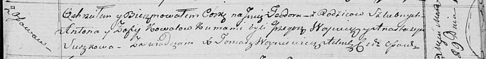

**Коваль Тодора Антонова (Kowalowna Teodora)**

29 марта 1818 г -- крещение (НИАБ 136-13-894, лист 98, №10/1818-р
(коп)).

**НИАБ 136-13-894:** Лист 98. **Метрическая запись №10/1818-р (ориг).**

{width="6.496527777777778in"
height="0.79790135608049in"}

Осовская Покровская церковь. 29 марта 1818 года. Метрическая запись о
крещении.

Kowalowna Teodora -- дочь родителей с деревни Осовo.

Kowal Anton -- отец.

Kowalowa Zofija -- мать.

Woynicz Grzegorz -- кум.

Suszkowa Anastazyja -- кума.

Woyniewicz Tomasz -- ксёндз.
