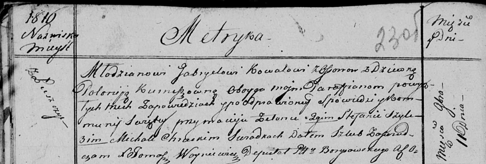
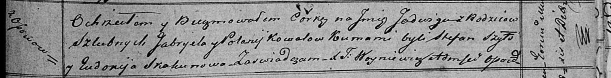

**Коваль (в девичестве Курнеш) Полония (Kowalowa Połonija z Kurneszow)**

11 ноября 1816 г -- венчание с молодым Габриэлем Ковалём с деревни Осово
(НИАБ 136-13-920, лист 23об, №10/1816-б (коп)).

30 сентября 1817 г -- крещение дочери Тодоры (НИАБ 136-13-894, лист
97об, №58/1817-р (коп)).

12 октября 1819 г -- крещение дочери Ядвиги (НИАБ 136-13-894, лист 103,
№56/1819-р (коп)).

**НИАБ 136-13-920:** Лист 23об. **Метрическая запись №10/1816-б
(ориг).**

Осовская Покровская церковь. 11 ноября 1816 года. Запись о венчании.

Kowal Gabriel -- жених, молодой, парафии Осовской, с деревни Осово.

Kurneszowna Połonija -- невеста, девка, парафии Осовской, с деревни
Лустичи.

Zielonka Maciey -- свидетель.

Szyło Stefan -- свидетель.

Chrucki Michał -- свидетель.

Woyniewicz Tomasz -- ксёндз.

**НИАБ 136-13-894:** Лист 97об. **Метрическая запись №58/1817-р
(ориг).**

Осовская Покровская церковь. 30 сентября 1817 года. Метрическая запись о
крещении.

Kowalowna Teodora -- дочь родителей с деревни Осовo.

Kowal Gabriel -- отец.

Kowalowa Połonija -- мать.

Szyło Stefan -- кум.

Skakunowa Eudokija -- кума.

Woyniewicz Tomasz -- ксёндз.

**НИАБ 136-13-894:** Лист 103. **Метрическая запись №56/1819-р (ориг).**

Осовская Покровская церковь. 12 октября 1819 года. Метрическая запись о
крещении.

Kowalowna Jadwiga -- дочь родителей с деревни Осовo.

Kowal Gabriel -- отец.

Kowalowa Połonija -- мать.

Szyło Stefan -- кум.

Skakunowa Eudokija -- кума.

Woyniewicz Tomasz -- ксёндз.
